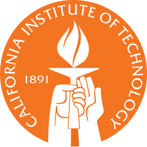

# About Me


- Name: **Dr. Vishesh Khemani**
- Pronunciation: *vish-AYSH kay-MAA-nee*
  - You can call me *vish* or *vish-AYSH* or *professor* or *dr kay-MAA-nee* or *dr k* or any similar combo of my name/dr/professor
  - Here's the *regular language* of valid ways to address me (defined as an [NFA](https://vk-cs-foundations-fall-25.github.io/shared-notes/notes/theory/nfa.html))

  ```mermaid
  stateDiagram-v2
    direction LR
    [*] --> fname : vish-AYSH | vish
    fname --> [*]
    [*] --> title : professor | doctor
    title --> [*]
    title --> name : vish-AYSH | kay-MAA-nee | vish | v | k
    name --> [*]
  ```

- Email: vishesh.khemani@lwtech.edu
- LinkedIn: https://www.linkedin.com/in/vishesh-khemani/
- [Resume](./resume.md)

## My Story

|                |                                                                                                                                                                                                                                                                                                                                                                         |                                                                                                                                                                                                                                                                                                                                                                         |
| -------------- | ----------------------------------------------------------------------------------------------------------------------------------------------------------------------------------------------------------------------------------------------------------------------------------------------------------------------------------------------------------------------- | ----------------------------------------------------------------------------------------------------------------------------------------------------------------------------------------------------------------------------------------------------------------------------------------------------------------------------------------------------------------------- |
| 1975 - 94      |                                                                                                                                                                                                                                                       | I grew up in Kolkata, India, back in the pre-internet era. I got into computer programming in high school, coding in GW-Basic on my "state-of-the-art" Intel 8088 processor running MS-DOS with floppy disk storage.                                                                                                                                                    |
| 1994 - 98      |                                                                                                                                                                                                                                              | I came to the US for college, where I double-majored in Computer Science (because I enjoyed coding) and Physics (inspired by the book Genius on the life of Feynman). I was totally unprepared for the New Hamphsire winter: I was fired for my own safety from a work-study job (delivering pizza on a bike at night) when I returned frozen blue from my first shift. |
| 1998 - 2005    |  | I did research in Theoretical Physics (PhD and PostDoc) to better grasp what we understand about the universe. Turns out that we don't know a whole lot e.g. what 95% of the universe is made out of.                                                                                                                                                                   |
| 2005 - 24      |                                                                                                                   | I switched to a career in software engineering, building large-scale distributed systems like Cloud Compute/Storage, Maps, and Caching. I found, to my delight, that solving deep problems, impacting millions of people, and making a decent living are not mutually exclusive.                                                                                        |
| 2025 - present |                                                                                                                                              | I've recently embarked on my third career, as a professor of Computer Science. I think I've found my calling!                                                                                                                                                                                                                                                           |
